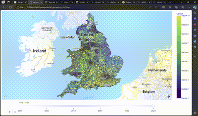
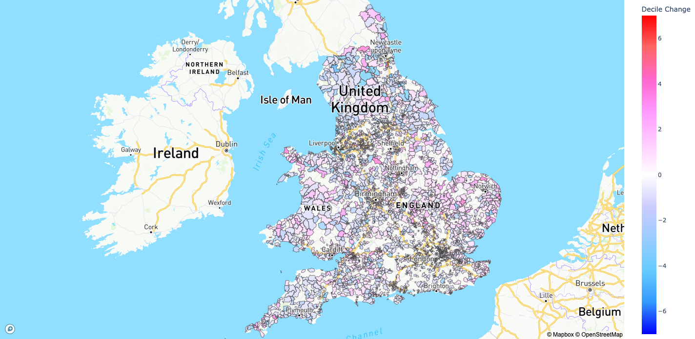

# Chloropleth map animation

[HTML download](https://www.dropbox.com/scl/fi/rzbyw4ge1eprlg46w1upb/sectors_vis7.html?rlkey=tnxlgcpe4ah5su91esgp87lxi&dl=0)

### Project Overview

Using the `plotly.express` module in `Python`, I created an animated choropleth map to visualise UK postcode sectors, coloured by their house value deciles relative to the national average, with a slider for exploring trends from January 2008 to January 2023. Full html download found [here](https://www.dropbox.com/scl/fi/rzbyw4ge1eprlg46w1upb/sectors_vis7.html?rlkey=tnxlgcpe4ah5su91esgp87lxi&dl=0) to interact with the visualisation. 

The North-South divide is instantly apparent, which has notably intensified over time. Northern regions, including the North-East, Liverpool, Manchester, Birmingham, and parts of Wales, initially positioned in the mid to low decile range in 2008, have descended to the bottom decile by 2023. Similarly, areas in Yorkshire, the Humber, and Cumbria, despite ranking within the top four deciles in 2008, have experienced relative house price stagnation compared to their southern counterparts. In stark contrast, the most consistently high-performing sectors are predominantly located around London, with decile rankings decreasing as distance from the capital increases. This disparity underscores an urgent need for governmental investment in the North. The observed stagnation not only mirrors a deficiency in opportunities and innovation but also contributes to escalating resource allocation inefficiencies and widening inequalities.

***
### Data and Implementation 

Sector level indices were estimated using my Autoregressive Mixed Effects house pricing model and the Land Registry's Price Paid datset (full details on estimation methodology found in my [UK-House-Price-Models repository](https://github.com/arashid9-1/UK-House-Price-Models/tree/main)). The geospatial data mapping the postcode sector boundaries is publically available in Geojson fomat thanks to [Mark's blog](https://longair.net/blog/2021/08/23/open-data-gb-postcode-unit-boundaries/). However, the bounderies were simplified to the nearest kilometer to reduce the computational load, hence the imperfect jigsaw puzzle. The period and time gap was chosen to balance analytic richness against rendering time. Further, it important to see how relative regional house prices have developed since the Global Financial Crsis.

<i>Sector decile changes from 2008 to 2023</i>

